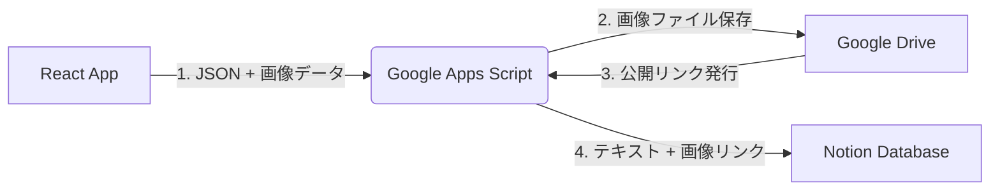

# Image Analyst App

画像をアップロードしてGemini AIで解析し、詳細なプロンプト情報の抽出、ポーズ生成、そしてNotionデータベースへの自動保存を行うWebアプリケーションです。

## 🚀 主な機能

- **画像分析 (Image Analysis)**
  - Gemini 2.5 Flash を使用して画像を解析。
  - 被写体、服装、背景、ライティングなどを詳細なJSONデータとして抽出。
  - 「日本人女性 ("Japanese woman")」などの特定キーワードを含めたプロンプト生成。

- **ポーズ抽出 (Pose Extraction)**
  - 画像内の人物ポーズを解析し、線画（Line Art）スタイルの参照画像を生成。
  - イラスト制作や資料として活用可能。

- **Notion連携 (Save to Notion)**
  - 解析結果（JSONデータ）と元画像をワンクリックでNotionに保存。
  - 画像はGoogle Driveに保存され、その公開リンクがNotionに埋め込まれます。

## 🛠 システムアーキテクチャ

データ処理のフローは以下の通りです：



## 💻 セットアップと実行

### 前提条件

- **Node.js**: 実行環境
- **Gemini API Key**: Google AI Studioで取得
- **Google Apps Script (GAS)**: デプロイ済みのスクリプト（Notion/Drive連携用）

### インストール手順

1.  **インストール**
    依存関係をインストールします。

    ```bash
    npm install
    ```

2.  **環境変数の設定**
    ルートディレクトリに `.env` または `.env.local` ファイルを作成し、GeminiのAPIキーを設定します。

    ```env
    GEMINI_API_KEY=your_gemini_api_key_here
    ```

3.  **GASエンドポイントの設定**
    ルートディレクトリにある `App.tsx` ファイルを開き、`GAS_API_URL` 定数の値をデプロイしたGoogle Apps ScriptのURLに変更してください。

4.  **アプリケーションの起動**
    開発サーバーを立ち上げます。

    ```bash
    npm run dev
    ```

## 📦 技術スタック

- **Frontend**: React, Vite, TypeScript
- **Styling**: Tailwind CSS
- **AI Models**:
  - `gemini-2.5-flash` (解析用)
  - `gemini-2.5-flash-image` (画像生成用)
- **Integration**: Google Apps Script (GAS), Google Drive, Notion API
