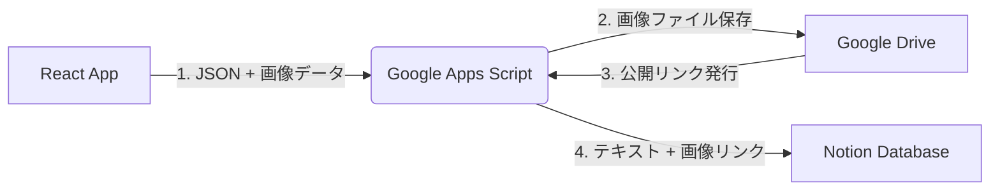

# Image Analyst App (Gemini 3.0 Imaginator)

画像をアップロードして分析し、詳細なプロンプト（JSON形式）と、構図やキャラクターデザインの参考となるビジュアルガイドを生成するWebアプリケーションです。
Gemini 2.5 Flash / Flash Image を活用し、Stable DiffusionやMidjourneyなどの画像生成AIで使用可能なプロンプト作成を支援します。

## 🚀 主な機能

1.  **画像分析 (Image Analysis)**
    - Gemini 2.5 Flash を使用して画像を解析。
    - 被写体、服装、背景、ライティングなどを詳細なJSONデータとして抽出。
    - 全要素を統合した「Full Prompt」も自動生成。

2.  **ポーズ線画生成 (Pose Line Art)**
    - 元画像の構図とポーズを忠実に再現した、シンプルな線画（白黒）を生成。
    - イラスト制作やControlNet等の参照画像として活用可能。

3.  **正面顔ガイド生成 (Frontal Face Visual Guide)**
    - 元画像が横顔や斜めであっても、キャラクターの顔を「正面向き」に変換した線画を生成。
    - キャラクターデザイン（三面図）やLoRA学習用データセット作成を支援。

4.  **顔専用プロンプト生成 (Frontal Face JSON)**
    - 正面顔ガイドに対応した、顔の特徴（目、髪型、表情など）に特化した詳細なJSONプロンプトを生成。

5.  **Notion連携 (Save to Notion)**
    - 解析結果と元画像をワンクリックでNotionデータベースに保存。
    - 画像はGoogle Driveに保存され、その公開リンクがNotionに埋め込まれます。

## 🛠 システムアーキテクチャ

データ処理のフローは以下の通りです：



## 💻 セットアップと実行

### 前提条件

- **Node.js**: 実行環境
- **Gemini API Key**: Google AI Studioで取得
- **Google Apps Script (GAS)**: デプロイ済みのスクリプト（Notion/Drive連携用）

### インストール手順

1.  **依存関係のインストール**

    ```bash
    npm install
    ```

2.  **環境変数の設定**
    ルートディレクトリに `.env` (または `.env.local`) ファイルを作成し、Gemini APIキーを設定してください。

    ```env
    GEMINI_API_KEY=your_gemini_api_key_here
    ```

3.  **GASエンドポイントの設定**
    ルートディレクトリの `App.tsx` を開き、`GAS_API_URL` 定数をデプロイしたGoogle Apps ScriptのWebアプリURLに書き換えてください。

4.  **開発サーバーの起動**

    ```bash
    npm run dev
    ```

## 📦 技術スタック

- **Frontend**: React, Vite, TypeScript
- **Styling**: Tailwind CSS
- **AI Models**:
    - `gemini-2.5-flash`: テキスト/ビジュアル分析、JSON生成
    - `gemini-2.5-flash-image`: 画像生成（ポーズ、正面顔ガイド）
- **Integration**: Google Apps Script (GAS), Google Drive, Notion API

## 📝 開発メモ

- **スタイル統一**: プロンプトエンジニアリングにより、解析結果の文字列値は日本語で出力されます。
- **UIレイアウト**: ソース画像 / 分析結果 / ビジュアルガイド等の情報を整理して表示し、効率的な作業フローを提供します。